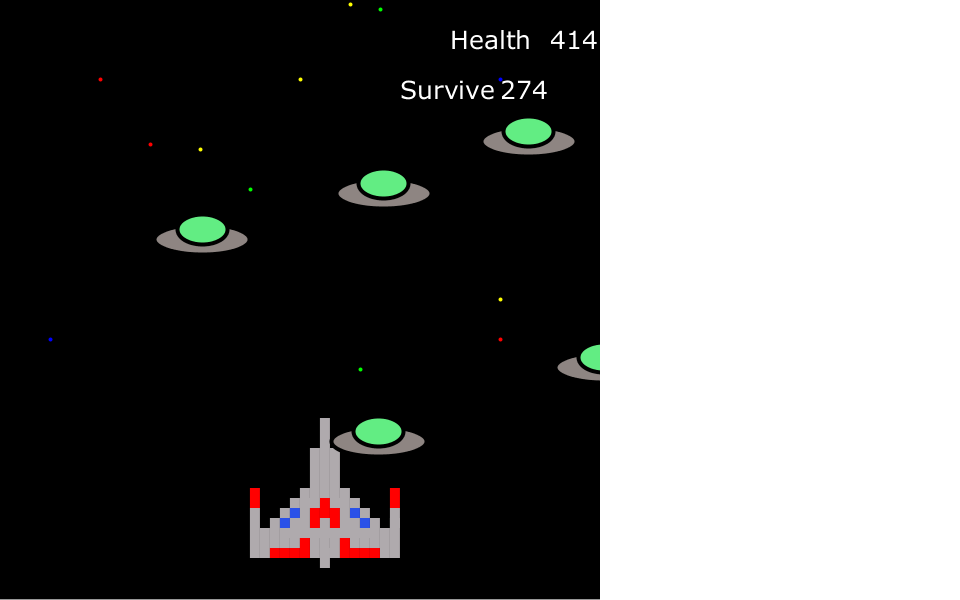
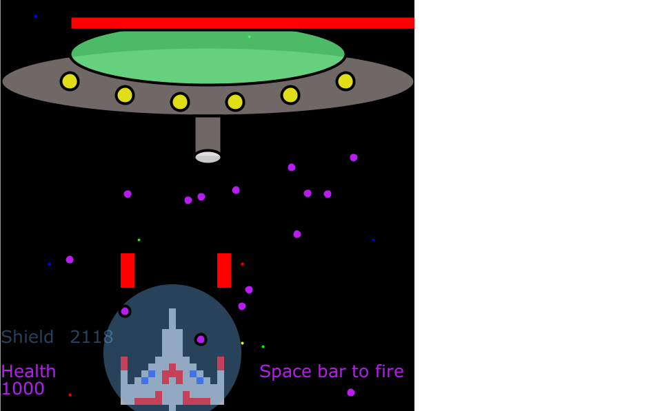

Project_Galaxy
==============

A simple ship game made in Processing

INSTRUCTIONS:
    MOVEMENT: Click and drag the ship to Move.           Lasers: Only accessible once you reach the boss level, press the space bar.
*Advance the story by pressing a circular button in the lower right hand corner of the screen.
*For the first three levels the goal is to survive. Avoid the UFO's and don't let your health
drop to zero. Once the survive timer runs out, advance to the next level by pressing the button in the
lower right hand side of the screen.
*The space bar to fire the lasers only works at the boss level.

SCREENSHOTS
______________________________________

